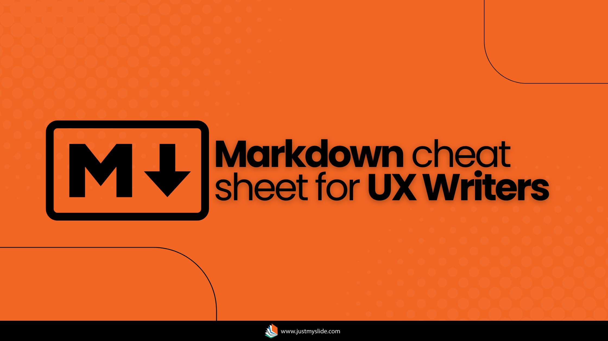

# Markdown Cheat Sheet for UX Writers



Markdown is a simple, lightweight markup language that helps you format text quickly—perfect for UX writers working in docs, design systems, or developer collaboration. Here’s a handy cheat sheet covering the essentials.  

---

## 1. Headings  
Structure your content with hierarchy.  

```markdown
# Heading 1 (H1)  
## Heading 2 (H2)  
### Heading 3 (H3)  
#### Heading 4 (H4)  
```  

**Example:**  
```markdown
# Onboarding Guide  
## Step 1: Sign Up  
### Create Your Profile  
```  

---

## 2. Text Formatting  
Emphasize key points with bold, italics, and more.  

| Style          | Syntax              | Example Output        |  
|---------------|--------------------|----------------------|  
| **Bold**      | `**text**` or `__text__` | **Important!** |  
| *Italic*      | `*text*` or `_text_` | *Note: This is optional.* |  
| ~~Strikethrough~~ | `~~text~~` | ~~Old feature~~ |  
| `Inline Code` | `` `code` `` | `Click "Save"` |  

**Example:**  
```markdown  
**Warning:** Do not *delete* this file. Use `rm -rf` carefully.  
```  

---

## 3. Lists  
Organize steps, features, or bullet points.  

### Unordered Lists 
```markdown
- Item 1  
- Item 2  
  - Nested item (indent with 2 spaces)  
```  

### Ordered Lists  
```markdown
1. First step  
2. Second step  
   1. Sub-step  
```  

**Example:**  
```markdown
- **Required Fields:**  
  - Email  
  - Password  
1. **Sign Up**  
2. **Verify Email**  
```  

---

## 4. Links & Images  
Add clickable links and embed images.  

| Element | Syntax | Output |  
|--------|--------|---------|  
| **Link** | `[text](URL)` | [Google](https://google.com) |  
| **Image** | `` |  |  

**Example:**  
```markdown  
[Contact Support](#) or check the .  
```  

---

## 5. Tables  
Structure data in a readable format.  

```markdown
| Column 1     | Column 2     |  
|-------------|-------------|  
| Row 1, Cell 1 | Row 1, Cell 2 |  
| Row 2, Cell 1 | Row 2, Cell 2 |  
```  

**Example:**  
```markdown
| Button Text | Action          |  
|------------|----------------|  
| **Save**   | Stores changes |  
| **Cancel** | Discards input |  
```  

---

## 6. Code Blocks  
Share snippets or UI labels clearly.  

**Inline Code:**  
`` `Click "Submit"` `` → `Click "Submit"`  

**Multiline Code:**  
````markdown
```javascript  
console.log("Hello, world!");  
```  
````  

**Example for UX Writing:**  
````markdown
```plaintext  
Error: Invalid email format.  
```  
````  

---

## 7. Blockquotes 
Highlight notes or warnings.  

```markdown
> **Note:** Passwords must be 8+ characters.  
```  

**Output:**  
> **Note:** Passwords must be 8+ characters.  

---

## 8. Horizontal Rule 
Separate sections visually.  

```markdown
***
___  
```  
**Output:**  

This is some content before horizontal line.
***
This is some content after horizontal line.

---
## 9. Escaping Special Characters 
Use `\` before a symbol to display it literally.  

```markdown
\*This won’t italicize\* → *This won’t italicize*  
```  

---

## 10. Advanced (Useful for UX Writers) 

### **Task Lists** (GitHub-flavored)  
```markdown
- [x] Write onboarding copy  
- [ ] Review with legal  
```  

### **Variables** (For localization)  
```markdown  
Hello, {{user_name}}! Your cart has {{item_count}} items.  
```  

---

## **Where to Practice Markdown?**  
- **Typora** (Simple editor)  
- **VS Code** (With Markdown preview)  
- **StackEdit** (Online)  
- **GitHub/GitLab** (For docs)  

---

### **Why UX Writers Love Markdown**  
✅ **No formatting fights** – Plain text = fewer inconsistencies.  
✅ **Works everywhere** – Docs, Figma, GitHub, Notion, Slack.  
✅ **Developer-friendly** – Easy to version-control (Git).

> **Pro Tip:** Save this cheat sheet as `README.md` for quick reference! 🚀  
---

Read my blog [JustMySlide.com](https://wp.me/p5nliZ-hp)